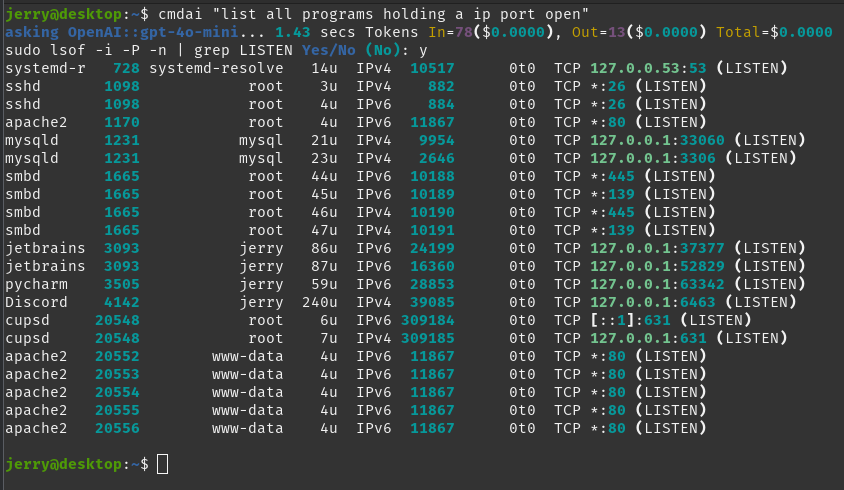

# Command Line AI Assistance
## usage

## cmdai

cmdai is an executable built from the python program cmdai.py. 
You give it a question and it returns the appropriate shell command.

    $ cmdai --help
    usage: cmdai [-h] [-m MODEL] [-l] [-k] [-d] [-v] [-c CONFIG] [question]
    
    positional arguments:
      question              The user question
    
    options:
      -h, --help            show this help message and exit
      -m MODEL, --model MODEL
                            Name of the model
      -l, --list            List all companies and models
      -k, --key             Ask for (new) Company Key
      -d, --debug           Print message to LLM, for debugging purposes.
      -v, --version         show program's version number and exit
      -c CONFIG, --config CONFIG
                            Path to the config file. Default: ~/.config/cmdai.ini
## Version
    $ cmdai --version
    cmdai 0.9.4
    $ 

## Supported LLms:

    $ cmdai --list

### Available Models

| Company   | Model                    |
|-----------|--------------------------|
| OpenAI    | gpt-4o                   |
|           | gpt-4o-mini              |
|           | o1-preview               |
|           | o1-mini                  |
|           | gpt-4-turbo              |
| XAI       | grok-beta                |
| Mistralai | mistral-large-latest     |
|           | mistral-small-latest     |
|           | mistral-large-2407       |
|           | mistral-small-2409       |
|           | codestral-2405           |
|           | mistral-embed            |
|           | ministral-3b-latest      |
|           | ministral-8b-latest      |
|           | pixtral-12b              |
|           | mistral-nemo             |
|           | open-mistral-7b          |
|           | open-mixtral-8x7b        |
|           | open-mixtral-8x22b       |
| Anthropic | claude-3-5-sonnet-latest |
|           | claude-3-opus-latest     |
|           | claude-3-sonnet-20240229 |
|           | claude-3-haiku-20240307  |

### Select LLM
Select your llm with the ***--model gpt-4o-mini*** <-- Use this model

Once a model is selected it will be used until you select a different model.

## API KEYs
The program requires an API_KEY from each company to access the LLM.

You will be prompted for the api key the first time you use an LLM of a company 
or when you specify --key option to set new key.  
Keys are securely stored on your machine, using python keyring package.

    $ cmdai "list the current values of my temperature sensors" -k
    Please enter your OpenAI API key: [paste your key here]
    asking OpenAI::gpt-4o-mini...execute? 
    sensors Yes/No (No): n
    $ 

## Operating System Integration.
I've built (or plan to build) executables for 3 operating systems

| **operating system** | **filename**  | 
|----------------------|---------------|
| windows              | win/cmdai.exe |
| linux                | lin/cmdai     |
| macos                | mac/cmdai     |

### Linux
1. Copy the file lin/cmdai to the directory ~/.local/bin/
2. make sure ~./local/bin is in your executable path.

### Windows
1. Copy the file win/cmdai.exe to the directory ???
2. make sure ??? is in your executable path.

## MacOs
1. Copy the file mac/cmdai to the directory ???
2. make sure ??? is in your executable path.

## Building Executables
executables are built using  
### Linux
1. Copy the file lin/cmdai to the directory ~/.local/bin/
2. make sure ~./local/bin is in your executable path.

### Windows
1. Copy the file win/cmdai.exe to the directory ???
2. make sure ??? is in your executable path.

## MacOs
1. Copy the file mac/cmdai to the directory ???
2. make sure ??? is in your executable path.

# Eh Th-Th-Th-Th-Th-Th-That is all Folks!
enjoy